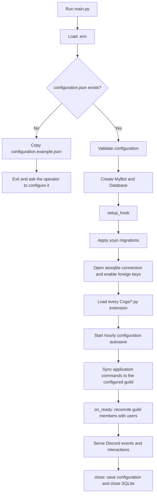
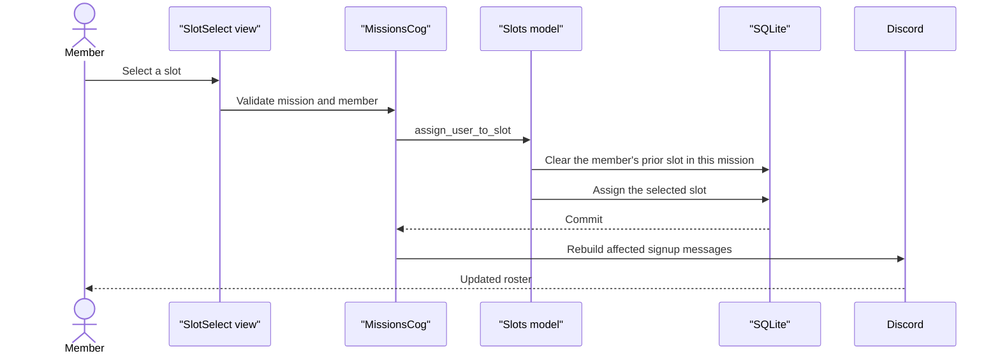

# Architecture

FogDiscordBot is a single-process `discord.py` application for one FOG Discord guild. It combines Discord interaction handlers, an asynchronous SQLite data layer, persistent component views, and a JSON configuration file. This document describes the current implementation; it is not a deployment runbook.

## Repository map

- `main.py` owns process startup, bot lifecycle, cog discovery, guild command synchronization, configuration autosave, and shutdown.
- `configuration.py` creates and validates local configuration.
- `Cogs/` contains Discord slash commands, listeners, views, and background loops.
- `db/database.py` owns the SQLite connection and yoyo migration step.
- `db/models.py` contains asynchronous, SQL-oriented data access classes.
- `db/migrations/` is the immutable history of the database schema.
- `ticket/` contains ticket categories, handlers, and Discord UI components.
- `scripts/check.py` is the portable local quality entry point.
- `tests/` exercises configuration and domain behavior without connecting to Discord.

## Process lifecycle

`main.py` uses all Discord intents and copies the application command tree into `guild_id`. This deliberately targets the single FOG guild instead of globally publishing commands. Cog modules are discovered from the filesystem and loaded as extensions, so a new cog becomes part of startup automatically when it provides the normal `setup(bot)` entry point.

The `on_ready` reconciliation marks every database user as off-guild, then inserts or updates the current non-bot guild members as present. It preserves historical users for attendance, warning, and mission references.

An hourly background loop writes the in-memory configuration dictionary to `configuration.json`. The same save happens during graceful shutdown. Commands that edit configuration therefore change the shared dictionary first and rely on this lifecycle for persistence.

## SQLite and migrations

`Database.connect()` applies every pending yoyo migration before opening the long-lived `aiosqlite` connection. The connection then executes `PRAGMA foreign_keys = ON`; this must remain enabled for the documented cascades and `SET NULL` behavior.

The committed migrations are the schema source of truth. Applied migrations must never be edited. Add schema changes as the next numbered migration and validate them against a new temporary database. Tests do not use `db/bot.db`.

Model classes in `db/models.py` are thin asynchronous query collections. They commit writes themselves and normally return positional SQLite rows rather than named domain objects. Consult [Data model](data-model.md) before changing query columns or destructuring call sites.

## Persistent views

Discord component callbacks must survive process restarts:

- `MissionsCog.cog_load()` restores signup selects and sign-out buttons from mission, squad, and slot records. It also recreates future one-hour reminders.
- `TrainingsCog.cog_load()` restores training signup views for stored message IDs.
- `TicketsCog.cog_load()` restores button- and select-based ticket creation views from serialized categories.

The database is the durable source for these registrations. `bot.add_view(...)` rebinds callbacks to existing Discord messages; it does not recreate missing messages. If a message, channel, or permission changed outside the bot, restoration can log an error or leave the component unusable until an administrator recreates it.

Mission and training interactions use in-memory `asyncio.Lock` instances to serialize related edits in this process. These locks do not coordinate multiple bot processes, so only one application instance should write the same database and Discord messages.

## Main data flows

### Mission signup

The mission, squad, and slot records hold the durable state; the Discord messages are projections rebuilt from those records. The complete workflow is in [Mission domain](domain/missions.md).

### Attendance and rank promotion

`/misja_obecnosc` derives attendees from occupied mission slots, removes explicitly mentioned absentees, and increments attendance records. It then dispatches the internal `attendance` event. `RanksCog` handles that event, compares the new total with the seeded rank thresholds, updates the user's database rank, and adjusts Discord roles when promotion is due.

### Tickets

Ticket create messages store their selected categories as JSON in `ticket_create_messages`. A persistent view reconstructs `TicketCategory` values, normalizes the category name, and selects a handler from `ticket.core.TYPE_HANDLERS`. Handlers create category-specific channels, permission overwrites, initial messages, and buttons. Ticket lifecycle state is stored in `tickets`.

## External boundaries

- Discord is the interaction, identity, permissions, role, channel, and message boundary.
- `configuration.json` is local operational state and may contain real Discord IDs; it is intentionally ignored by Git.
- `.env` provides `DISCORD_BOT_TOKEN` and `DEBUG`; it is not a configuration fallback.
- SQLite is local persistent domain state.
- `logs/bot.log` and the service journal are operational evidence, not domain state.

Automated tests stop at these boundaries. They do not use a bot token, connect to Discord, validate guild permissions, or exercise restored components against real messages.
