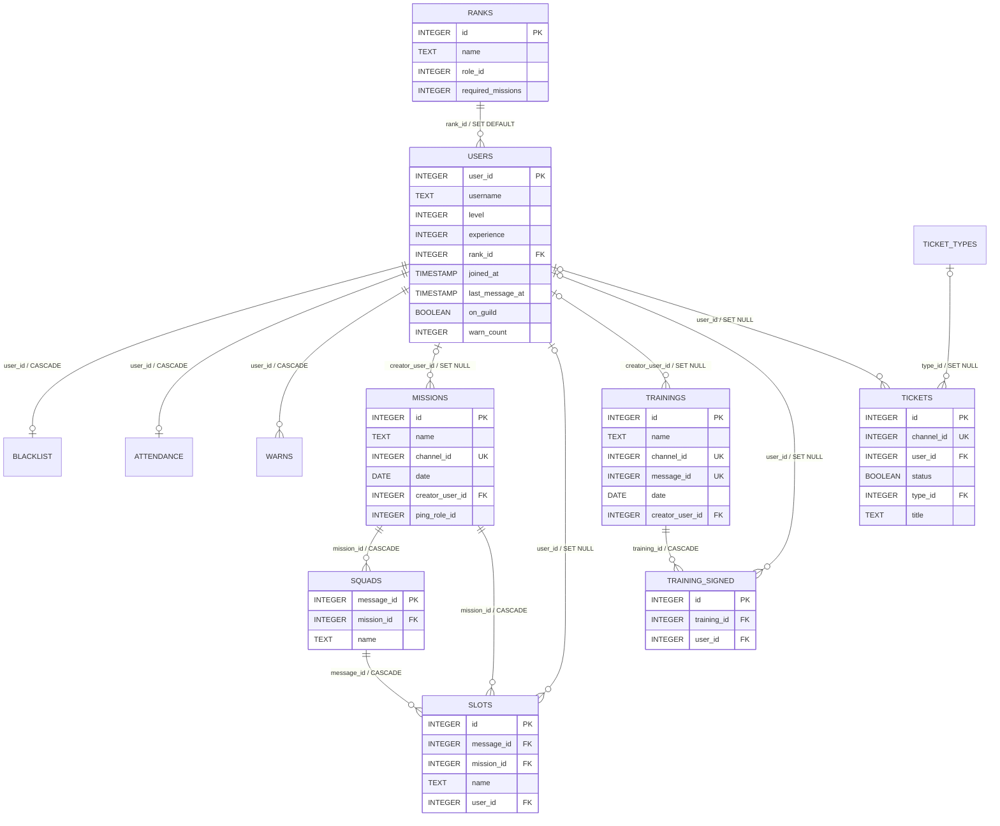

# Data model

SQLite is the durable source of truth for bot users, missions, training signups, tickets, warnings, and rank progression. The schema is defined by immutable yoyo migrations under `db/migrations/`; the modules in `db/models/` are the query interface used by the cogs. Applying migrations is an offline deployment phase through `python -m scripts.migrate --database <path>`, not an application-startup action.

## Entity relationships

`ticket_create_messages` is independent of `tickets`: it maps one configured Discord channel and message to serialized ticket categories. It has unique `channel_id` and `message_id` columns. It has no foreign keys because those identifiers belong to Discord, not another SQLite entity.

## Table ownership

| Table | Primary writer | Meaning and lifecycle |
| --- | --- | --- |
| `ranks` | Migration seed | Ordered mission thresholds and matching Discord role IDs. |
| `users` | startup, arrival/departure, level/rank/warn flows | Local record of guild identity and accumulated state. Historical users remain with `on_guild = 0`. |
| `blacklist` | `BlacklistCog` | At most one current blacklist record per user. |
| `attendance` | `AttendanceCog` | One cumulative row per user, not one row per mission. |
| `missions` | `MissionsCog` | Active/historical mission definition; one mission per Discord channel. |
| `squads` | `MissionsCog` | A mission signup message; Discord message ID is the primary key. |
| `slots` | `MissionsCog` | Signup choices and assignments for a squad and mission. |
| `trainings` | `TrainingsCog` | Training definition and persistent signup message. |
| `training_signed` | training view and `TrainingsCog` | Training-to-user signup rows. |
| `ticket_types` | Migration seed | Stable normalized handler names. |
| `tickets` | ticket handlers/views | Ticket channel, owner, type, status, and title. |
| `ticket_create_messages` | `TicketsCog` | Persistent ticket creation view registrations. |
| `warns` | `WarnsCog` | Warning history with an expiry flag. |

## Cascades and counters

Deleting a mission cascades to its squads and slots. Deleting a squad cascades to its slots. Deleting a training cascades to its signup rows. Deleting a user cascades blacklist, attendance, and warnings, while creator, signup, slot, and ticket references become `NULL` where the schema permits it.

Migration `002` creates warning triggers. Inserts and deletes recalculate `users.warn_count` from non-expired warnings for the affected user. `Warns.recalculate_expired()` marks records older than 30 days as expired and recalculates every user's counter because an `UPDATE` of `expired` is not covered by those insert/delete triggers.

Foreign-key actions only apply on connections where `PRAGMA foreign_keys = ON`. `Database.connect()` enables it for the application connection and refuses to connect while committed migrations are pending; the test suite asserts both the current-schema and foreign-key contracts.

## Seed data

Migration `001` seeds:

- six ordered rank thresholds, beginning at zero missions;
- ticket handler types `mission`, `proposal`, `recruitment`, `basic_training`, and `custom`.

Rank seeds contain historical real Discord role IDs. They are part of applied migration history and must not be copied to safe examples or rewritten in place. Applied migration files are immutable; a future schema/data correction needs a new migration.

## Discord identifiers

The database stores Discord snowflake identifiers in SQLite `INTEGER` columns:

- `users.user_id` identifies a Discord member;
- channel IDs connect missions, trainings, tickets, and ticket-create messages to Discord channels;
- message IDs connect squads, training views, and ticket-create views to persistent Discord messages;
- role IDs connect ranks and optional mission pings to Discord roles.

These are external identifiers, not database-generated foreign keys unless the schema explicitly says otherwise. They are sensitive operational data and must be zeroed or invented in examples and fixtures.

## Positional row contracts

Model methods return tuples in each SQL `SELECT` order. Common contracts are:

| Model method | Tuple fields |
| --- | --- |
| `Users.get_user` | `user_id, username, level, experience, rank_id, joined_at, last_message_at, on_guild, warn_count` |
| `Missions.get` / `get_channel` | `id, name, channel_id, created_at, creator_user_id, date, ping_role_id` |
| `Squads.get` | `message_id, mission_id, name` |
| `Slots.get_by_message` | `id, name, user_id` |
| `Slots.get_by_mission` | `message_id, id, name, user_id` |
| `Slots.get_by_mission_and_user` | `id, message_id, mission_id, name, user_id` |
| `Attendance.get_by_user` | `user_id, last_mission_date, all_time_missions` |
| `Ranks.get` / `get_next_rank` | `id, name, role_id, required_missions` |
| `Trainings.get` / `get_channel` | `id, name, channel_id, message_id, created_at, creator_user_id, date` |
| `Tickets.get_by_channel` | `id, channel_id, user_id, created_at, status, type_id, title` |
| `TicketCreateMessages.list` | `channel_id, message_id, categories` |
| `Warns.get` | `id, user_id, reason, added_at, expired` |

Changing a `SELECT` list or order is therefore a public internal interface. Search all destructuring call sites and update tests/documentation together.

## Known constraints

- The schema uses naive `DATE`/`TIMESTAMP` values interpreted in local server time.
- There is no unique constraint on `(training_id, user_id)`. `INSERT OR IGNORE` alone does not prevent duplicate training signups.
- Attendance is cumulative and not keyed to mission ID, so recording the same mission twice increments totals twice.
- Migration history contains deployment-specific rank role IDs.
- The data layer uses positional tuples rather than named records or domain entities.
