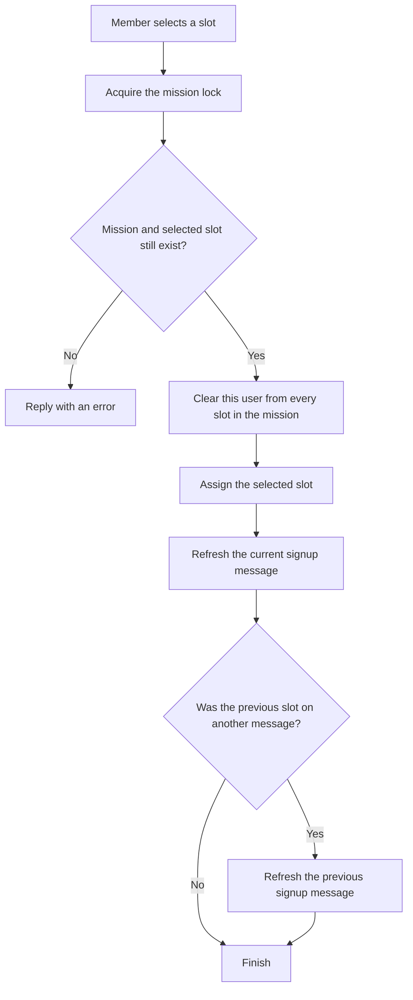

# Mission domain

Missions are the bot's central workflow. A mission owns one Discord channel, zero or more signup messages represented as squads, and the slots displayed by those messages. Attendance and rank progression are calculated from occupied slots.

## Domain terms

- **Mission**: name, scheduled local date and time, Discord channel, creator, and optional ping role.
- **Squad**: one signup message belonging to a mission. Its primary key is the Discord message ID.
- **Slot**: a globally numbered position with a display name and optional Discord user.
- **Attendance**: a user's latest attended date and cumulative mission count.
- **Rank**: a seeded progression threshold associated with a Discord role ID.

## Create and announce a mission

`/misja_stworz` is available to an administrator or a member/user listed in `permissions.mission_makers`. When `channels.scheduled_missions_channel_id` is configured, the interaction must be in that channel.

The command accepts a mission name and a future date in `YYYY-MM-DD HH:MM` format. The datetime is parsed in the bot host's local timezone without timezone information. Only one active mission can use a channel because `missions.channel_id` is unique.

The command persists the mission first. If `roles.mission_ping_role_id` is configured and present, it can announce the mission to that role and schedules a reminder one hour before the mission. A second announcement is scheduled one hour after creation. Future reminders are reconstructed when the cog loads after a restart.

## Create signup messages

`/misja_zapisy_stworz` is restricted to the mission creator or a Discord administrator. The supplied semicolon-separated slot names are stripped and rendered as a Discord select menu; one message can hold at most 25 options. The posted message ID becomes the squad ID, and each slot is inserted with the mission and squad relationship.

Each message receives:

- a persistent `SlotSelect` for selecting an open slot;
- a persistent `SignOutButton` for leaving the mission;
- text generated by `services.missions.mission_message_content(...)` (kept available through `_message_content(...)` for the cog's existing private boundary), which shows the mission, squad, and current assignments.

## Select, move, and leave a slot

A user can occupy at most one slot per mission through the model operation. Selecting another slot is a move: the prior assignment is cleared before the new assignment is written. The per-mission lock prevents two callbacks in this process from interleaving the update and message rebuild.

Mission creators and Discord administrators can use `/misja_zapisy_wpisz` to assign another member manually. `druzyna_id` is the ID of the signup message, not the displayed squad name; the message must belong to the mission in the current channel. `slot` is matched case-insensitively against a free slot name. The command uses the first free matching slot, moves the member out of any previous slot in the same mission, and refreshes both the target and previous signup messages.

Members can use the persistent sign-out button or `/misja_zapisy_wypisz`. Self-service sign-out is refused during the final 12 hours before the mission. Administrative/creator command handling can remove an assignment when moderation is required.

`/misja_zapisy_usun` removes a signup message and its squad/slots for a mission creator or administrator. Deleting or cancelling the entire mission deletes its squads and slots through foreign-key cascades.

## Edit or cancel a mission

`/misja_edytuj` and `/misja_anuluj` require the original creator or a Discord administrator.

Editing can change the name and scheduled datetime, then rebuilds existing signup messages. Changing the time also updates scheduled reminder work. A known implementation defect affects the path where only the name is supplied: the command can reference the datetime variable before it is assigned. Treat name-only editing as a manual-test item until the command is fixed.

Cancellation stops tracked scheduled tasks, deletes signup messages that are still reachable, and deletes the mission record. SQLite cascades remove squads and slots even when a Discord message is already unavailable.

## Record attendance

`/misja_obecnosc` is restricted to the mission creator or an administrator. The command collects every non-null `slots.user_id` for the mission and removes users explicitly supplied as absent. It increments each remaining user's `attendance.all_time_missions` and stores the mission date as `last_mission_date`.

The command then:

1. dispatches the custom `attendance` event once per attendee;
2. posts a report in `channels.attendance_channel_id` when configured;
3. leaves the mission and signup data in place.

Because the operation increments counters, repeating the command for the same mission increments them again. There is no per-mission attendance ledger or idempotency constraint.

## Service boundary

`services.missions` contains the side-effect-free mission rules that are shared by command handlers and persistent components: roster rendering, command/stored-date parsing, the strict 12-hour self-service sign-out cutoff, semicolon-delimited slot normalization, slot-ID projection, and custom-ID construction. `MissionsCog` remains responsible for SQLite model calls, Discord responses and edits, per-mission locks, scheduled tasks, and persistent view registration. This keeps the existing tuple contracts and operation ordering at the cog/model boundary.

## Rank progression

`RanksCog.on_attendance` reads the user's attendance and current rank. It selects the first seeded rank whose `required_missions` is above the current rank threshold. When the cumulative attendance meets that next threshold, it updates `users.rank_id`, removes the prior Discord rank role, and assigns the next role.

The rank rows and thresholds are seeded by migration `001`. Those historical rows include deployment-specific role IDs. Do not copy them into examples, logs, fixtures, or documentation; introduce any future corrections with a new migration.

## Failure and consistency boundaries

- SQLite transactions and foreign keys protect local relational state, but Discord message edits cannot participate in the same transaction.
- Missing channels/messages and changed Discord permissions can leave a correct database projection that cannot be rendered until repaired manually.
- Dates are naive server-local values. Daylight-saving changes and deployment to another timezone can change reminder and 12-hour cutoff behavior.
- Persistent views and reminder restoration need manual verification in a test guild because unit tests never contact Discord.
- The in-process locks do not make multi-instance execution safe.

## Manual verification checklist

- Create a future mission in the configured channel as an authorized mission maker.
- Create two signup messages, move one member between them, and verify both messages refresh.
- Restart the bot in a test environment and verify the select and sign-out button still respond.
- Check the self-sign-out boundary outside and inside 12 hours.
- Record attendance with one absent user and verify the report, database totals, and eligible role promotion.
- Cancel the mission and confirm its signup messages and stored squads/slots are removed.
